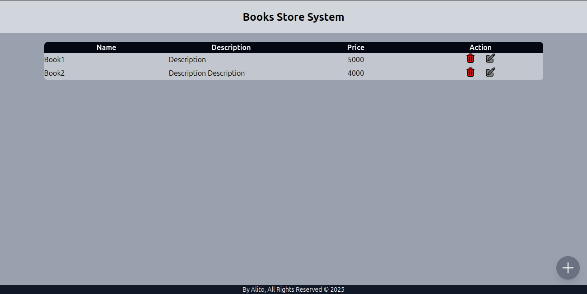
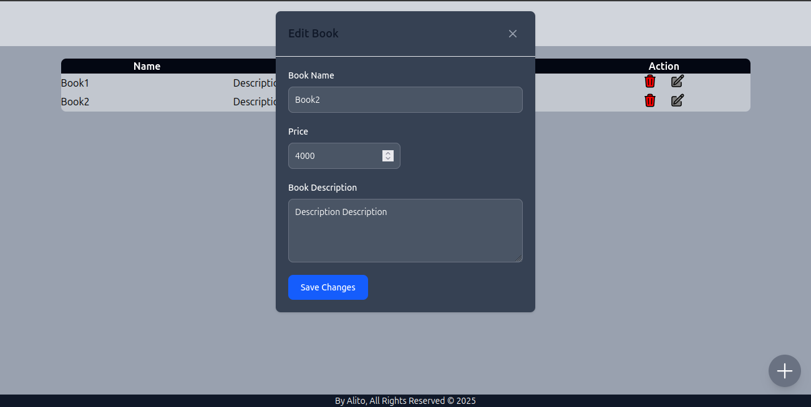

## ✨ Book Store System CRUD Dashboard UI

### Features:
- View all books from API
- Add new books
- Edit existing books
- Delete books

### How to Run:
1. npm install
2. npm run dev

### Built with:
 - React 
 - Tailwind CSS 
 - vite
 - typeScript
 - Redux ToolKit
 - React-Hook-Form

### Screen Shots:
#### Main Page:

#### Add Book Form:

#### Edite Book:
